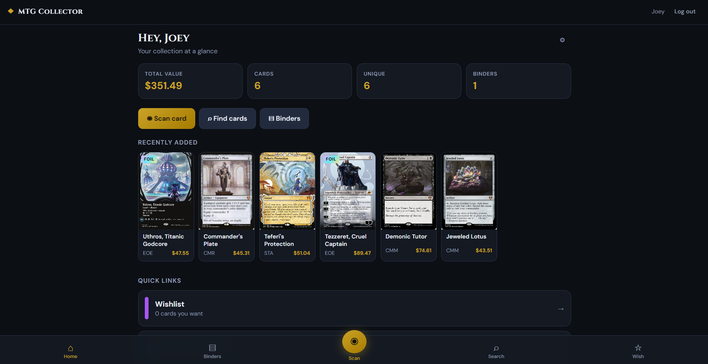

<p align="center">
  <strong>◆ MTG Collector</strong><br>
  <em>Scan, price, and organize your Magic: The Gathering collection — at home, on any device.</em>
</p>

<p align="center">
  
</p>

<p align="center">
  <a href="#features">Features</a> ·
  <a href="#quick-start">Quick start</a> ·
  <a href="#docker">Docker</a> ·
  <a href="#phone-access">Phone access</a> ·
  <a href="#usage">Usage</a> ·
  <a href="#tech-stack">Tech</a>
</p>

---

## About

**MTG Collector** is a self-hosted web app for managing a physical Magic card collection. Run it on your computer (or a home server), open it on your phone over Wi‑Fi, and scan cards with the camera. Each family member gets their own login, binders, and wishlist — no cloud account required.

Card data and market prices come from [Scryfall](https://scryfall.com). Everything else stays on your machine in a local SQLite database.

---

## Features

| | |
|---|---|
| **📷 Card scanning** | Camera or photo upload → OCR → auto-match name & printing |
| **💰 Live pricing** | USD market values (foil & non-foil) via Scryfall |
| **📁 Multiple binders** | Separate collections (EDH, trades, bulk, kids…) |
| **👤 Family accounts** | Private logins — collections never mix |
| **🔍 Search** | Full Scryfall catalog + search within your own cards |
| **↕️ Sort & filter** | Name, price, CMC, rarity, set, type, foil, condition, date |
| **⭐ Wishlist** | Track wants; one tap to move into a binder when you get them |
| **📊 Stats** | Total value, rarity breakdown, most valuable cards |
| **⬇️ Export** | CSV export per binder |
| **🔄 Price sync** | Refresh market values anytime |
| **📋 QoL** | Condition / foil / notes, duplicates finder, move between binders |
| **🐳 Docker** | One-command deploy with persistent volume |

---

## Quick start

### Option A — Docker (recommended)

**Requirements:** [Docker](https://docs.docker.com/get-docker/) Desktop or Engine + Compose

```bash
docker compose up -d --build
```

| Where | URL |
|--------|-----|
| This PC | http://localhost:3847 |
| Phone (same Wi‑Fi) | http://**YOUR-HOST-IP**:3847 |

```bash
docker compose logs -f    # logs
docker compose down       # stop (keeps your data)
```

Full Docker guide: **[docs/DOCKER.md](docs/DOCKER.md)**

---

### Option B — Node.js (local dev)

**Requirements:** [Node.js](https://nodejs.org/) 18+

**Windows:** double-click `start-dev.bat` (dev) or `start.bat` (production).

```bash
npm run setup
npm run dev
```

| Where | URL |
|--------|-----|
| This PC | http://localhost:5173 |
| Phone | http://**YOUR-PC-IP**:5173 |

Production without Docker:

```bash
npm run setup
npm run build
npm start
```

→ http://localhost:3847

---

## Docker

### Basic

```bash
# Build & run in background
docker compose up -d --build

# Optional: host port + session secret
cp .env.example .env
# edit PORT / SESSION_SECRET
docker compose up -d
```

### Data persistence

Collections are stored in the Docker volume **`mtg-collector-data`** (`/data/mtg.db` in the container). Rebuilds and restarts keep your binders unless you run `docker compose down -v`.

**Backup the database:**

```bash
docker compose cp mtg-collector:/data/mtg.db ./mtg-backup.db
```

**Bind-mount to a folder** (edit `docker-compose.yml`):

```yaml
volumes:
  - ./data:/data
```

### Update

```bash
git pull
docker compose up -d --build
```

See [docs/DOCKER.md](docs/DOCKER.md) for restore, troubleshooting, and firewall notes.

---

## Phone access

1. Host PC and phone on the **same Wi‑Fi** (or Tailscale / LAN)  
2. Start the app (Docker or Node)  
3. On the phone, open **http://HOST-IP:3847** (Docker/production) or **:5173** (dev)  

The app’s **Settings** page also lists addresses when running outside Docker.

If the phone can’t connect, allow inbound TCP on **3847** (and **5173** for dev) on the host firewall.

---

## Usage

1. **Register** an account for each person  
2. **Scan** a card (center the name line) or **search** the catalog  
3. Pick the **exact set/printing**, condition, foil, and binder  
4. Browse **Binders** to sort, filter, edit qty, and check value  
5. Use **$ Sync** on a binder to refresh prices  

Tips for scanning: good light, sharp focus on the **card name**, or type the name if OCR struggles.

---

## Tech stack

- **Frontend** — React, Vite, mobile-first UI  
- **Backend** — Node.js, Express, session auth  
- **Database** — SQLite (`/data/mtg.db` in Docker, or `server/data/mtg.db`)  
- **Recognition** — Tesseract.js OCR + Scryfall fuzzy match  
- **Prices & catalog** — [Scryfall API](https://scryfall.com/docs/api)  
- **Deploy** — multi-stage Docker image, Compose, healthcheck  

---

## Project layout

```
├── client/               # React UI
├── server/               # API, auth, OCR, Scryfall
├── docs/                 # Screenshot + Docker guide
├── Dockerfile            # Multi-stage production image
├── docker-compose.yml    # One-service deploy + volume
├── .env.example          # PORT / SESSION_SECRET
├── start-dev.bat         # Windows local dev
└── start.bat             # Windows local production
```

---

## Environment variables

| Variable | Default | Used by |
|----------|---------|---------|
| `PORT` | `3847` | Host port (Compose) / server listen port |
| `HOST` | `0.0.0.0` | Bind address |
| `DATA_DIR` | `server/data` or `/data` | SQLite directory |
| `SESSION_SECRET` | dev default | Session cookie signing |

---

## Data & privacy

- Collection data is **local SQLite** only — back up `mtg.db`  
- No third-party user accounts; sessions stay on your server  
- Images and prices are fetched from Scryfall as needed  
- Prices are market **estimates**, not live checkout quotes  

---

## License

Personal / family use. Card imagery and data © Wizards of the Coast / provided via Scryfall’s API terms.
